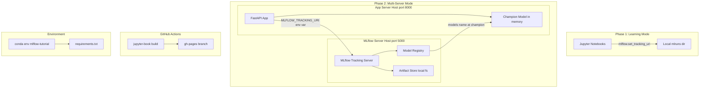
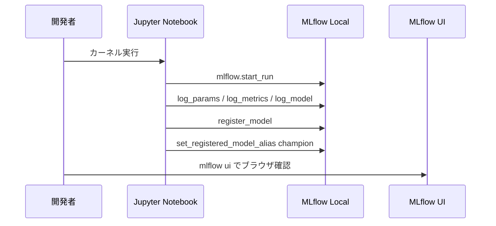
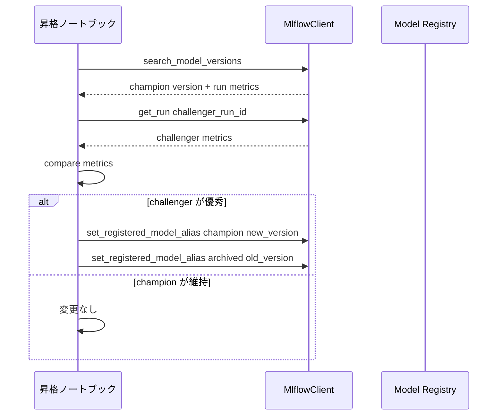
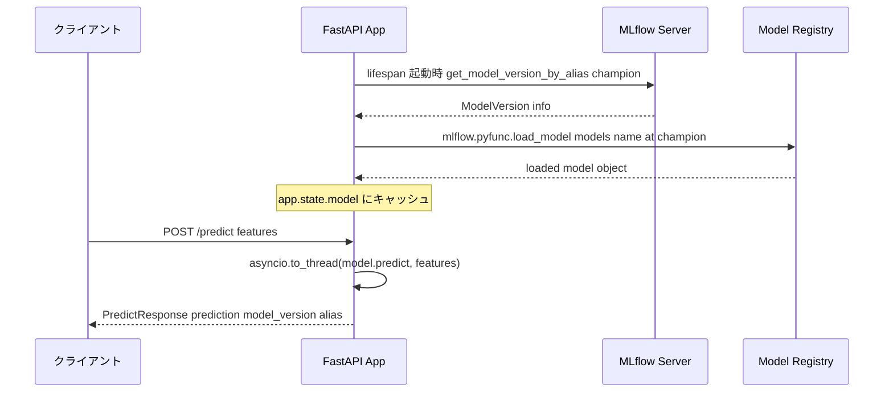

# Design Document — mlflow-tutorial

## Overview

本チュートリアルは MLflow を初めて使う ML エンジニア・データサイエンティストを対象に、MLflow の全体像から実務レベルのモデル管理・サービングまでを段階的に学べるコンテンツを提供する。コンテンツは Jupyter Book 0.15.x（`_config.yml` / `_toc.yml` 形式）でビルドされ、GitHub Pages で公開される。ノートブックはすべてオフライン環境（外部インターネット非接続）で実行可能であり、データセットには sklearn 内蔵データセットまたはコード生成の合成データのみを使用する。

アーキテクチャは学習フェーズとデプロイフェーズの2段階で構成される。学習フェーズはシングルマシン・ファイルベースで完結し、デプロイフェーズでは MLflow Tracking Server と FastAPI Web アプリを別プロセス（別ターミナル）で起動する2サーバー構成に移行する。Docker は使用しない。

### Goals

- MLflow の4コンポーネント（Tracking・Models・Model Registry・Projects）を体系的に説明する
- sklearn・PyTorch それぞれのトレーニングから登録・推論までを実演するノートブックを提供する
- チャンピオン/チャレンジャーパターンを MLflow エイリアス API で実装するワークフローを示す
- FastAPI + MLflow の2サーバー構成でチャンピオンモデルをサービングするデプロイパターンを示す
- すべての手順が外部インターネット非接続環境で再現可能であること

### Non-Goals

- Docker / コンテナオーケストレーションの使用（Docker 使用不可のため）
- クラウドストレージ（S3・Azure Blob・GCS）へのアーティファクト保存
- Jupyter Book 2.0（MyST `myst.yml`）形式への移行（今後の拡張として保留）
- Hyperopt・Ray Tune 等 Optuna 以外の外部 HPO ライブラリとの統合
- モデルモニタリング・ドリフト検知

---

## Architecture

### Architecture Pattern & Boundary Map



**Key Decisions**:
- Phase 1（ノートブック学習）はシングルマシンで `./mlruns` に記録する。MLflow Server は不要
- Phase 2（デプロイ）で初めて MLflow Server をネットワーク越しに起動し、`MLFLOW_TRACKING_URI` で接続先を切り替える
- CI は pre-executed ノートブックの HTML 変換のみを行い、ノートブック再実行は行わない

### Technology Stack

| Layer | 採用技術 / バージョン | 役割 | 備考 |
|-------|---------------------|------|------|
| ドキュメント | Jupyter Book 0.15.x | ノートブックを HTML サイトへビルド | v2.0 の `myst.yml` は非採用（research.md 参照） |
| HPO | Optuna（最新安定版）| ハイパーパラメータ最適化（Req 4） | TPESampler を使用。外部接続不要 |
| ML フレームワーク | scikit-learn（最新安定版）| Req 2 サンプル | sklearn 内蔵データセットのみ使用 |
| ML フレームワーク | PyTorch（最新安定版）| Req 3 サンプル | 合成データのみ。`torch.manual_seed()` で再現性確保 |
| 実験管理 | MLflow >= 2.8.0 | Tracking・Model Registry・エイリアス API | 2.8.0 でエイリアス機能が導入（research.md 参照）|
| Web API | FastAPI + uvicorn | チャンピオンモデル推論エンドポイント | lifespan でモデルロード |
| データバリデーション | Pydantic v2 | FastAPI リクエスト/レスポンス型定義 | FastAPI の標準依存 |
| 環境管理 | conda | 仮想環境 `mlflow-tutorial` | オフライン時は conda local channel または pip wheel |
| CI/CD | GitHub Actions | Jupyter Book ビルド → gh-pages デプロイ | `execute_notebooks: "off"` で再実行しない |

---

## System Flows

### Flow 1: ノートブック学習フロー（Phase 1）



### Flow 2: チャンピオン/チャレンジャー昇格フロー（Req 9）



### Flow 3: FastAPI 起動・推論フロー（Req 10・11）



---

## Requirements Traceability

| 要件 | 概要 | コンポーネント | インターフェース | フロー |
|------|------|--------------|----------------|--------|
| 1.1–1.4 | MLflow コア概念説明 | TutorialContent | — | — |
| 2.1–2.5 | sklearn サンプル | SklearnNotebook | MLflowTrackingIF | Flow 1 |
| 3.1–3.4 | PyTorch サンプル | PyTorchNotebook | MLflowTrackingIF | Flow 1 |
| 4.1–4.6 | Optuna HPO + 実験比較 | ExperimentNotebook | MLflowSearchIF, OptunaIF | — |
| 5.1–5.5 | Jupyter Book 構成 | JupyterBookConfig | — | — |
| 6.1–6.4 | GitHub Pages デプロイ | CICDWorkflow | — | — |
| 7.1–7.6 | 環境セットアップ | EnvironmentConfig | — | — |
| 8.1–8.6 | オフライン動作保証 | 全ノートブック | — | — |
| 9.1–9.5 | チャンピオン/チャレンジャー管理 | ChampionChallengerNotebook | ModelRegistryIF | Flow 2 |
| 10.1–10.6 | Web アプリ搭載・サービング | FastAPIApp | PredictIF | Flow 3 |
| 11.1–11.5 | マルチサーバー構成ガイド | ServerStartupGuide | — | Flow 3 |

---

## Components and Interfaces

### コンポーネント一覧

| Component | Layer | Intent | Req Coverage | Key Dependencies | Contracts |
|-----------|-------|--------|--------------|-----------------|-----------|
| TutorialContent | Content | MLflow 概念説明ページ群 | 1.1–1.4 | JupyterBookConfig (P0) | — |
| SklearnNotebook | Content | sklearn トレーニング + ロギング | 2.1–2.5, 8.1–8.6 | MLflowTrackingIF (P0), sklearn (P0) | Service |
| PyTorchNotebook | Content | PyTorch トレーニング + ロギング | 3.1–3.4, 8.1–8.6 | MLflowTrackingIF (P0), PyTorch (P0) | Service |
| ExperimentNotebook | Content | Optuna によるハイパーパラメータ最適化 + MLflow 記録 | 4.1–4.6 | MLflowSearchIF (P0), Optuna (P0) | Service |
| ChampionChallengerNotebook | Content | エイリアス管理ワークフロー | 9.1–9.5 | ModelRegistryIF (P0) | Service |
| JupyterBookConfig | Config | `_config.yml` / `_toc.yml` 構成 | 5.1–5.5 | — | — |
| CICDWorkflow | Infra | GitHub Actions deploy.yml | 6.1–6.4 | JupyterBookConfig (P0) | Batch |
| EnvironmentConfig | Config | `environment.yml` / `requirements.txt` | 7.1–7.6, 8.1 | — | — |
| FastAPIApp | Service | チャンピオンモデル推論 API | 10.1–10.6 | ModelRegistryIF (P0), MLflowServer (P0) | API, Service |
| ServerStartupGuide | Doc | 2サーバー起動手順書 | 11.1–11.5 | FastAPIApp (P0), MLflowServer (P0) | — |

---

### Content Layer

#### SklearnNotebook / PyTorchNotebook / ExperimentNotebook

| Field | Detail |
|-------|--------|
| Intent | MLflow Tracking へのロギング・Model Registry 登録を実演するノートブック |
| Requirements | 2.1–2.5, 3.1–3.4, 4.1–4.3, 8.1–8.6 |

**Responsibilities & Constraints**
- すべてのデータセットを `sklearn.datasets` 内蔵データまたは `numpy` / `torch` による合成データで生成する（Req 8.1）
- 実行時に外部ネットワーク接続を行わない（Req 8.3–8.4）
- `mlflow.set_tracking_uri()` で Tracking URI を明示設定する。Phase 1 では `./mlruns`、Phase 2 では環境変数 `MLFLOW_TRACKING_URI`
- `torch.manual_seed()` を PyTorch ノートブックの先頭で設定し出力を再現可能にする

**Dependencies**
- Inbound: Jupyter Kernel — ノートブック実行 (P0)
- Outbound: MLflow Tracking Server（Phase 1 はファイルシステム、Phase 2 はネットワーク）(P0)
- External: scikit-learn, PyTorch, numpy — データ生成・モデル定義 (P0)

**Contracts**: Service [x]

##### Service Interface（MLflow Tracking 呼び出しパターン）

```python
# Phase 1: シングルマシン
mlflow.set_tracking_uri("./mlruns")

# Phase 2: ネットワーク接続（環境変数で切り替え）
mlflow.set_tracking_uri(os.environ["MLFLOW_TRACKING_URI"])

with mlflow.start_run(experiment_id: str) as run:
    mlflow.log_params(params: dict[str, Any]) -> None
    mlflow.log_metric(key: str, value: float, step: int | None = None) -> None
    mlflow.sklearn.log_model(sk_model: Any, artifact_path: str) -> None
    mlflow.pytorch.log_model(pytorch_model: nn.Module, artifact_path: str) -> None
```

- Preconditions: MLflow Tracking URI が到達可能であること
- Postconditions: `./mlruns`（または Server）に run, params, metrics, artifacts が記録されること
- Invariants: 各ノートブックの実行は外部インターネット接続なしで完了すること

**Implementation Notes**
- Integration: 各ノートブックの先頭セルに `mlflow.set_tracking_uri` を記述し、Phase 切り替えは環境変数による1行変更で済む設計とする
- Validation: セル実行後に `mlflow.get_tracking_uri()` を表示し、接続先を確認できるようにする
- Risks: MLflow < 2.8.0 環境では `set_registered_model_alias` が `AttributeError` を発生させる。「はじめに」ページにバージョン確認コマンド（`mlflow --version`）を記載する

---

#### ExperimentNotebook

| Field | Detail |
|-------|--------|
| Intent | Optuna による体系的なハイパーパラメータ探索と MLflow Tracking を統合し、最良 trial のモデルを Model Registry に登録する |
| Requirements | 4.1–4.6, 8.1–8.6 |

**Responsibilities & Constraints**
- Optuna の `study.optimize()` のコールバック内で `mlflow.start_run()` を呼び出し、trial ごとに1 MLflow run を作成する
- データセットは `sklearn.datasets` 内蔵データを使用し、実行時の外部通信は行わない（Req 8.1）
- `TPESampler` を使用する（デフォルト。外部サービス不要）
- `study.best_trial` から最良 run ID を特定し、`mlflow.register_model()` でモデルを登録する

**Dependencies**
- Outbound: MLflow Tracking Server（Phase 1 はファイルシステム）(P0)
- External: Optuna（最新安定版）, scikit-learn (P0)

**Contracts**: Service [x]

##### Service Interface（Optuna + MLflow 統合パターン）

```python
import optuna
import mlflow
from mlflow import MlflowClient

def objective(trial: optuna.Trial) -> float:
    # 探索空間の定義
    params: dict[str, Any] = {
        "max_depth": trial.suggest_int("max_depth", 2, 10),
        "learning_rate": trial.suggest_float("learning_rate", 1e-4, 1e-1, log=True),
        "n_estimators": trial.suggest_int("n_estimators", 50, 300),
    }

    with mlflow.start_run(nested=True):
        mlflow.log_params(params)
        # モデルトレーニング & スコア計算
        score: float = train_and_evaluate(params)
        mlflow.log_metric("cv_score", score)

    return score  # Optuna は最小化を前提（最大化する場合は direction="maximize"）

with mlflow.start_run(run_name="optuna_study") as parent_run:
    study = optuna.create_study(
        direction="maximize",
        sampler=optuna.samplers.TPESampler(seed=42),
    )
    study.optimize(objective, n_trials=30)

    # ベスト trial の run ID を取得してモデル登録
    best_run_id: str = get_best_run_id(study, parent_run.info.experiment_id)
    mlflow.register_model(f"runs:/{best_run_id}/model", "MyModel")
```

- Preconditions: MLflow Tracking URI が設定済みであること
- Postconditions: `n_trials` 個の child run が記録され、ベストモデルが Model Registry に登録されること
- Invariants: 各 trial は独立した MLflow run として記録される（`nested=True`）

**Implementation Notes**
- Integration: `parent_run` で study 全体を囲み、`nested=True` で各 trial を子 run として記録することで MLflow UI での階層表示を実現する
- Validation: `study.best_trial.value` と `mlflow.search_runs()` のスコアが一致することをノートブック末尾でアサートする
- Risks: trial 数が多い（>100）と MLflow の run 数が増えてローカルディスクを圧迫する。チュートリアルでは `n_trials=30` 程度に抑える

---

#### ChampionChallengerNotebook

| Field | Detail |
|-------|--------|
| Intent | MLflow エイリアス API を使ったチャンピオン/チャレンジャー管理ワークフローの実演 |
| Requirements | 9.1–9.5 |

**Responsibilities & Constraints**
- MLflow 2.8.0 以降のエイリアス API のみを使用する（旧 Stages API は使用しない）
- チャレンジャーとチャンピオンのメトリクスをプログラム上で比較し、条件付きで昇格する

**Dependencies**
- Outbound: MlflowClient — エイリアス操作 (P0)
- External: MLflow >= 2.8.0 (P0)

**Contracts**: Service [x]

##### Service Interface（ModelRegistry 操作）

```python
from mlflow import MlflowClient
from mlflow.entities.model_registry import ModelVersion

client = MlflowClient(tracking_uri: str)

# エイリアス付与
client.set_registered_model_alias(
    name: str,      # モデル名
    alias: str,     # "champion" | "challenger" | "archived"
    version: str    # モデルバージョン番号（文字列）
) -> None

# エイリアスでバージョン取得
client.get_model_version_by_alias(
    name: str,
    alias: str
) -> ModelVersion  # .version, .run_id, .tags を含む

# エイリアス削除（ロールバック時）
client.delete_registered_model_alias(
    name: str,
    alias: str
) -> None

# エイリアス URI でモデルをロード
mlflow.pyfunc.load_model(f"models:/{model_name}@champion") -> mlflow.pyfunc.PyFuncModel
```

- Preconditions: モデルが Model Registry に登録済みであること
- Postconditions: `@champion` エイリアスが新バージョンを指すよう更新されること
- Invariants: 任意の時点で `@champion` エイリアスは必ず1つのバージョンのみを指すこと

**Implementation Notes**
- Integration: 昇格ロジックはノートブック内の Python 関数として実装する（外部スクリプト化は非スコープ）
- Validation: `get_model_version_by_alias` で昇格後のエイリアスを確認するアサーション例を含める
- Risks: `@champion` が未設定の状態でロードしようとすると `MlflowException` が発生。初回登録フローとして例外ハンドリング例を示す

---

### Service Layer

#### FastAPIApp

| Field | Detail |
|-------|--------|
| Intent | MLflow Model Registry のチャンピオンモデルを起動時にロードし、推論エンドポイントを提供する |
| Requirements | 10.1–10.6, 11.4–11.5 |

**Responsibilities & Constraints**
- `MLFLOW_TRACKING_URI` 環境変数で MLflow Server の接続先を設定する
- lifespan コンテキストマネージャーで起動時に `@champion` モデルをロードし `app.state` に保持する
- 起動失敗（MLflow Server 未起動・モデル未登録）時は明確なエラーを出力してプロセスを終了する
- FastAPI アプリは MLflow Server とは別プロセスで起動する

**Dependencies**
- Inbound: HTTP クライアント（curl / Python requests）— 推論リクエスト (P1)
- Outbound: MLflow Tracking Server — モデルロード (`MLFLOW_TRACKING_URI`) (P0)
- External: FastAPI, uvicorn, Pydantic v2, MLflow >= 2.8.0 (P0)

**Contracts**: API [x], Service [x]

##### API Contract

| Method | Endpoint | Request | Response | Errors |
|--------|----------|---------|----------|--------|
| GET | /health | — | `HealthResponse` | 503 MLflow 未接続 |
| POST | /predict | `PredictRequest` | `PredictResponse` | 422 バリデーションエラー, 500 推論失敗 |

##### Service Interface

```python
from contextlib import asynccontextmanager
from fastapi import FastAPI
from pydantic import BaseModel

class PredictRequest(BaseModel):
    features: list[float]

class PredictResponse(BaseModel):
    prediction: list[float]
    model_name: str
    model_version: str
    alias: str

class HealthResponse(BaseModel):
    status: str          # "ok" | "error"
    tracking_uri: str
    model_name: str
    model_version: str

@asynccontextmanager
async def lifespan(app: FastAPI):
    # 起動時: champion モデルをロード
    tracking_uri: str = os.environ["MLFLOW_TRACKING_URI"]
    model_name: str = os.environ["MODEL_NAME"]
    mlflow.set_tracking_uri(tracking_uri)
    client = MlflowClient()
    mv: ModelVersion = client.get_model_version_by_alias(model_name, "champion")
    app.state.model = mlflow.pyfunc.load_model(f"models:/{model_name}@champion")
    app.state.model_version = mv.version
    yield
    # シャットダウン時: クリーンアップ（必要に応じて）

app = FastAPI(lifespan=lifespan)

@app.post("/predict", response_model=PredictResponse)
async def predict(req: PredictRequest) -> PredictResponse:
    import asyncio
    import numpy as np
    model = app.state.model
    features = np.array(req.features).reshape(1, -1)
    # model.predict() は同期 API のため asyncio.to_thread で実行してイベントループをブロックしない
    prediction = await asyncio.to_thread(model.predict, features)
    return PredictResponse(
        prediction=prediction.tolist(),
        model_name=os.environ["MODEL_NAME"],
        model_version=app.state.model_version,
        alias="champion",
    )
```

- Preconditions: `MLFLOW_TRACKING_URI` と `MODEL_NAME` 環境変数が設定されていること、`@champion` エイリアスが存在すること
- Postconditions: `/predict` が `PredictResponse` を返すこと
- Invariants: `app.state.model` は lifespan 期間中にのみ有効であること

**Implementation Notes**
- Integration: `MLFLOW_TRACKING_URI=http://localhost:5000 MODEL_NAME=MyModel uvicorn app.main:app --port 8000` で起動
- Validation: `/health` エンドポイントで MLflow 接続状態とモデルバージョンを返し、ヘルスチェックに使用する
- Risks: MLflow Python クライアントは同期 API のみ提供。`/predict` ハンドラー内で `model.predict()` を呼ぶ際は `asyncio.to_thread()` を使って非同期コンテキストをブロックしない

---

### Config Layer

#### JupyterBookConfig

| Field | Detail |
|-------|--------|
| Intent | Jupyter Book 0.15.x でビルド可能な設定ファイルと目次を定義する |
| Requirements | 5.1–5.5 |

**Contracts**: State [x]

##### State Management

```yaml
# _config.yml（主要設定のみ）
title: MLflow Tutorial
author: ""
execute:
  execute_notebooks: "off"   # Req 6.2: CI でノートブックを再実行しない
parse:
  myst_enable_extensions: ["colon_fence"]
```

```yaml
# _toc.yml（目次構造）
format: jb-book
root: intro
chapters:
  - file: notebooks/01_concepts/mlflow_overview
  - file: notebooks/02_sklearn/sklearn_autolog
  - file: notebooks/02_sklearn/sklearn_manual
  - file: notebooks/03_pytorch/pytorch_tracking
  - file: notebooks/04_experiment_management/hyperparam_search
  - file: notebooks/05_champion_challenger/champion_challenger
  - file: notebooks/06_deployment/fastapi_serving
```

- State model: ビルド設定はファイルシステム上の静的 YAML。ランタイム状態なし
- Persistence: リポジトリにコミットされ CI で読み込まれる
- Concurrency: 単一ビルドプロセスのみ

---

#### CICDWorkflow

| Field | Detail |
|-------|--------|
| Intent | mainブランチ push 時に Jupyter Book をビルドし gh-pages へデプロイする |
| Requirements | 6.1–6.4 |

**Contracts**: Batch [x]

##### Batch / Job Contract

- **Trigger**: `push` to `main` branch
- **Input / validation**: リポジトリのノートブック（`.ipynb`）とビルド設定（`_config.yml`, `_toc.yml`）
- **Output / destination**: `gh-pages` ブランチ（`_build/html/` の内容）
- **Idempotency & recovery**: 同一コミットの再 push でも同一ビルド結果が得られる。ビルド失敗時は Actions ログで各ステップを個別に確認可能（Req 6.4）

```yaml
# .github/workflows/deploy.yml（構造定義）
on:
  push:
    branches: [main]
jobs:
  deploy:
    steps:
      - uses: actions/checkout@v4
      - name: Set up Python
        uses: actions/setup-python@v5
      - name: Install dependencies
        run: pip install -r requirements.txt
      - name: Build Jupyter Book
        run: jupyter-book build .
      - name: Deploy to GitHub Pages
        uses: peaceiris/actions-gh-pages@v3
        with:
          github_token: ${{ secrets.GITHUB_TOKEN }}
          publish_dir: ./_build/html
```

---

#### EnvironmentConfig

| Field | Detail |
|-------|--------|
| Intent | conda 仮想環境定義とオフラインインストール手順を提供する |
| Requirements | 7.1–7.6, 8.1 |

**Contracts**: State [x]

##### State Management

```yaml
# environment.yml
name: mlflow-tutorial
channels:
  - defaults
dependencies:
  - python=3.11
  - pip
  - pip:
    - mlflow>=2.8.0
    - scikit-learn
    - torch
    - optuna
    - fastapi
    - uvicorn
    - jupyter-book>=0.15,<1.0
    - pydantic>=2.0
```

- **オンライン環境**: `conda env create -f environment.yml`
- **オフライン環境（pip wheel 方式）**: `pip download -r requirements.txt -d ./wheels` → `pip install --no-index --find-links=./wheels -r requirements.txt`
- **オフライン環境（conda channel 方式）**: `conda index ./local-channel` → `conda install -c file:///path/to/local-channel パッケージ名`

---

## Data Models

### Domain Model

本プロジェクトにおけるドメインエンティティは MLflow が管理する以下のオブジェクトである。

```
Experiment
  └── Run (1..*)
        ├── params: dict[str, str]
        ├── metrics: dict[str, list[float]]
        └── artifacts: list[ArtifactPath]

RegisteredModel
  └── ModelVersion (1..*)
        ├── version: str
        ├── run_id: str
        └── aliases: list[str]   # "champion" | "challenger" | "archived"
```

**Business Rules**:
- `@champion` エイリアスはゼロまたは1つの ModelVersion のみを指す
- `@challenger` エイリアスは昇格フロー中にのみ存在する
- エイリアス昇格は `@champion` の切り替えと `@archived` への旧バージョン移動をアトミックに（連続して）行う

### Data Contracts & Integration

**FastAPI リクエスト/レスポンス**

```python
# POST /predict
class PredictRequest(BaseModel):
    features: list[float]  # モデルの入力特徴量

class PredictResponse(BaseModel):
    prediction: list[float]  # モデルの出力（分類の場合は class index を float で返す）
    model_name: str
    model_version: str
    alias: str              # 常に "champion"

# GET /health
class HealthResponse(BaseModel):
    status: str             # "ok" | "error"
    tracking_uri: str
    model_name: str
    model_version: str
```

---

## Error Handling

### Error Strategy

ユーザー操作エラー（設定ミス）は起動時に早期検出して明確なメッセージを出力する。推論エラーはハンドラー内でキャッチし JSON レスポンスとして返す。

### Error Categories and Responses

| エラー種別 | 発生箇所 | 対応 |
|-----------|---------|------|
| `MLFLOW_TRACKING_URI` 未設定 | FastAPI lifespan | `KeyError` → 起動失敗、環境変数名を標準出力に表示 |
| MLflow Server 未起動 | FastAPI lifespan | `MlflowException: Connection refused` → 起動失敗、接続先 URI を表示 |
| `@champion` エイリアス未存在 | FastAPI lifespan | `MlflowException` → 起動失敗、モデル登録手順を案内 |
| MLflow バージョン < 2.8.0 | ノートブック実行時 | `AttributeError: set_registered_model_alias` → 「はじめに」ページのバージョン確認手順を参照 |
| 推論入力の型不正 | `POST /predict` | Pydantic `ValidationError` → HTTP 422 + フィールドエラー詳細 |
| `numpy` / `torch` シードなし | ノートブック | 出力が実行ごとに変わる → 各ノートブック先頭で `np.random.seed()` / `torch.manual_seed()` を設定 |

### Monitoring

- FastAPI: uvicorn のアクセスログ（標準出力）で `POST /predict` のリクエスト数を確認
- MLflow UI（`mlflow ui` / `mlflow server`）で Run・メトリクス・モデルバージョンを可視化
- チュートリアル目的のため、外部モニタリングサービスは使用しない

---

## Testing Strategy

チュートリアルコンテンツの品質検証は以下の方法で行う。

### ノートブック動作検証

- ローカルで `jupyter nbconvert --to notebook --execute` を使って各ノートブックがエラーなく実行完了することを確認する
- 検証時は conda 仮想環境 `mlflow-tutorial` をアクティベートした状態で実行する
- 検証対象: sklearn ノートブック・PyTorch ノートブック・実験比較ノートブック・チャンピオン/チャレンジャーノートブック（各 1 ノートブック）

### Jupyter Book ビルド検証

- `jupyter-book build .` がゼロエラーで完了すること
- 生成された `_build/html/index.html` をブラウザで開き、TOC と各ページが正しくレンダリングされることを目視確認する

### FastAPI エンドポイント検証

- `GET /health` が `{"status": "ok", ...}` を返すこと
- `POST /predict` に有効な `features` リストを送信して `prediction` を含む JSON が返ること
- 検証コマンド例:
  ```bash
  curl -X POST http://localhost:8000/predict \
    -H "Content-Type: application/json" \
    -d '{"features": [5.1, 3.5, 1.4, 0.2]}'
  ```

### オフライン動作検証

- conda 仮想環境をアクティベートした状態でネットワークを切断（または `--proxy none` 相当）してノートブックを実行し、全セルが正常完了することを確認する

---

## Security Considerations

- FastAPI は外部インターネット非公開の内部ネットワークで運用することを前提とする。認証・TLS は非スコープ
- `MLFLOW_TRACKING_URI`・`MODEL_NAME` は環境変数で設定する。ハードコーディング禁止
- MLflow アーティファクトはローカルファイルシステムに保存されるため、ファイルシステムのアクセス権でアクセス制御する

---

## Supporting References

詳細な調査ログ・バージョン選定の経緯・設計決定の根拠は [research.md](research.md) を参照。
